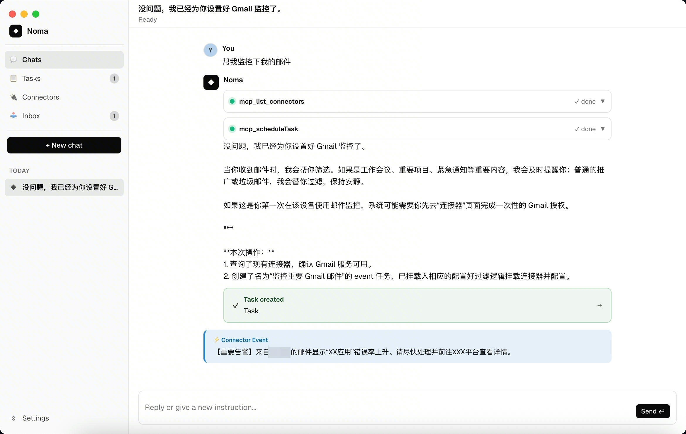
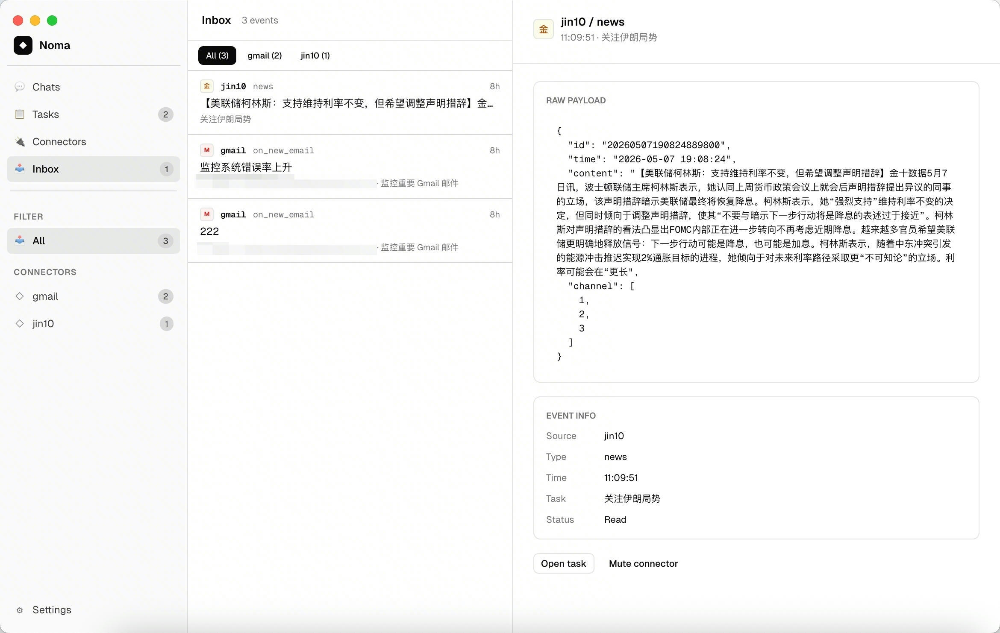

# Noma

[English](./README.md)

**本地优先的桌面 Agent，帮你盯着世界，只在重要时刻打扰你。**

Noma 连接各类数据源（Gmail、财经快讯等），在后台持续监控，当有值得关注的事件时主动通知你——一切都在你的本地机器上运行。





## 核心功能

- **自然语言创建任务** — 用对话告诉 Agent 你想盯什么，它会自动选择合适的连接器和参数。
- **连接器生态** — 内置 Gmail 和 Jin10（财经快讯）连接器。Agent 还能为任意公开 API 自动编写自定义连接器。
- **批量事件分析** — 连接器事件入队后每 60 秒批量分析一次。每批产出一条时间线摘要；只有匹配任务关注点的事件才触发通知，其余静默入库。超过 6 小时的摘要自动清理。
- **本地优先架构** — 会话、消息、任务、事件全部存储在本地 SQLite。服务端使用独立 SQLite 实例存储配置和 session memory——无需外部数据库。
- **原生无边框 UI** — 干净的 Electron 应用，支持明暗主题和中英双语。

## 架构

```
用户 ──► 桌面端 (Electron + React + SQLite)
           ├── Agent Bridge (codex exec)
           │     └── MCP 工具 (scheduleTask, list_connectors, notify)
           ├── 连接器运行时
           │     ├── jin10 (财经快讯)
           │     ├── gmail (邮件监控)
           │     └── 自定义连接器 (Agent 创建)
           └── 事件 Agent (LLM 评估事件 → 通知或忽略)

桌面端 ──► 服务端 (Hono + SQLite)
              ├── LLM 代理 (OpenRouter → Claude/GPT/Gemini)
              ├── OAuth (Google for Gmail)
              └── 连接器配置存储
```

## 仓库结构

```
apps/
  desktop/       Vite + React + Electron 桌面壳
  server/        Hono + SQLite 服务端
  eval/          自动化 Agent 与连接器评估
packages/
  agent/         CodexDirectBridge、MCP bridge
  event-agent/   事件分析 prompt、工具协议、运行时
  connector/     连接器 descriptor、runtime、内置连接器
  shared/        共享类型、模型配置、工具 schema
  mcp-tools/     供 Codex 挂载的 MCP stdio 工具服务
  ui/            共享 UI 组件 (Button, Tag, ConnectorIcon 等)
```

## 快速开始

### 前置条件

- **Node.js** >= 20
- **pnpm** >= 9
- **[Codex CLI](https://github.com/openai/codex)** — `npm i -g @openai/codex`
- **[ngrok](https://ngrok.com/)** — 用于 OAuth 回调（免费版即可）

### 1. 安装与构建

```bash
git clone https://github.com/Janlaywss/noma-ai.git
cd noma-ai
pnpm install
pnpm build
```

### 2. 配置服务端

```bash
cp apps/server/.env.example apps/server/.env
```

编辑 `apps/server/.env`，填入你的凭据：

| 变量 | 必填 | 说明 |
|------|------|------|
| `OPENROUTER_API_KEY` | 是 | [OpenRouter](https://openrouter.ai/) API key |
| `GOOGLE_CLIENT_ID` | Gmail 需要 | Google OAuth 客户端 ID |
| `GOOGLE_CLIENT_SECRET` | Gmail 需要 | Google OAuth 客户端密钥 |
| `PUBLIC_URL` | Gmail 需要 | 你的 ngrok 域名，如 `https://your-app.ngrok-free.dev` |

服务端 SQLite 数据库在首次启动时自动创建于 `data/server.db`，无需手动初始化。

### 3. 配置模型

启动桌面端后，进入 **设置 → 模型**，填写 Agent 模型和事件分析模型（必须是有效的 [OpenRouter 模型 ID](https://openrouter.ai/models)）。未配置模型前，应用不会启动 Agent 会话。

### 4. 运行

在两个终端中分别启动服务端和桌面端：

```bash
# 终端 1：服务端
pnpm --filter @noma/server dev

# 终端 2：桌面端
pnpm --filter @noma/desktop dev
```

服务端在 `PUBLIC_URL` 设置后会自动启动 ngrok tunnel。

## 连接器

| 连接器 | 类型 | 说明 |
|--------|------|------|
| **jin10** | 财经快讯 | 实时中文财经新闻和市场数据 |
| **gmail** | 邮件 | 通过 Google OAuth 监控 Gmail |

Agent 还能在运行时为任意公开 API **自动创建连接器**——只需描述你想监控什么。

## 数据与隐私

- 所有对话、任务和事件存储在**本地 SQLite**——不配置服务端同步时数据不会离开你的机器。
- 连接器事件在本地评估，只有 LLM 调用走服务端代理。
- OAuth token 存储在本地连接器存储中，不发送给第三方。
- 服务端不保存对话内容、事件原文或任务推理上下文。

## 技术栈

- **桌面端**：Electron + Vite + React + better-sqlite3
- **服务端**：Hono + better-sqlite3
- **Agent**：OpenAI Codex CLI + MCP 协议
- **LLM**：OpenRouter (Claude, GPT, Gemini 等)
- **语言**：全栈 TypeScript

## 许可证

MIT
