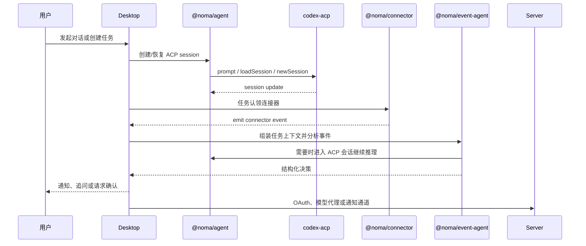

# 架构设计

本文描述 Noma AI 桌面端 Agent 当前落地版本的架构。目标是让用户对话和连接器事件共同驱动 Agent 决策，同时保持会话与敏感数据本地优先。

## 1. 设计目标

- 内置连接器模块，支持 GitHub、Gmail、Lark、股票、天气、航班、金十等上下文来源。
- 用户在对话中创建任务后，任务可以认领连接器并启动监听。
- 独立事件 Agent 处理连接器事件，结合任务上下文判断后续动作。
- 多轮对话与多会话能力由 ACP 托管，桌面端只保存本地索引和任务绑定。
- 连接器支持轮询和 Webhook 两类模式，当前代码已落地轮询型 runtime 与 descriptor 体系。
- 桌面端使用 Vite + React + Electron。
- 服务端使用 Hono + Supabase，并直接复用 `/Users/janlay/noma-ai/apps/server` 的既有代码；登录注册和请求鉴权已移除。

## 2. Workspace 边界

### apps/desktop

桌面端是用户入口和本地宿主。

当前已落地：

- Vite + React renderer。
- Electron main/preload。
- 主进程通过 `@noma/connector` 读取内置连接器注册表。
- 主进程通过 `@noma/agent` 解析 `codex-acp` 二进制可用性。
- renderer 首屏展示 ACP、server、connector、event-agent 的连通状态。

后续继续补：

- 本地数据库。
- 任务与会话列表。
- 连接器授权 UI。
- 系统通知。
- Keychain 与 connector host。

### apps/server

服务端使用 Hono + Supabase，代码从 `/Users/janlay/noma-ai/apps/server` 拷贝。

当前路由：

- `/healthz`
- `/api/channels`
- `/api/entities`
- `/api/session`
- `/api/connectors`
- `/api/channel-configs`
- `/api/settings`
- `/api/v1`
- `/api/notifications`

服务端职责：

- OAuth provider callback。
- OpenAI/模型代理。
- 连接器授权配置。
- 通知通道。
- 最小必要的远端状态。

服务端不保存 ACP 会话正文、连接器事件原文或任务推理上下文，也不做用户登录注册或请求鉴权。

### apps/eval

评估应用用于自动化验证。

当前已落地：

- `pnpm eval:agent` smoke eval。
- 校验内置连接器注册表包含关键连接器。
- 校验 `@noma/event-agent` 的事件类型契约可被消费。

后续继续扩展：

- 连接器事件 fixture 回放。
- 事件 Agent 结构化决策断言。
- 高风险动作确认门禁断言。
- ACP session 引用集成测试。

### packages/agent

`@noma/agent` 是 ACP 与 Codex 的桥接包。

职责：

- `AcpAgentBridge`：通过 ACP SDK 驱动 `codex-acp` 子进程。
- `startCodex`：准备 Codex home、模型配置、MCP server 配置并启动桥接。
- `resolveCodexBinary`：解析 npm 安装或打包内置的 `codex-acp` 二进制。
- LLM proxy 与 MCP bridge 辅助能力。

该包不直接实现连接器，也不保存会话正文。

### packages/event-agent

`@noma/event-agent` 是独立事件 Agent 的运行时基础。

职责：

- 定义 Agent run event、tool schema、tool call、stream hook 等协议。
- 提供 prompt、ReAct/runtime、LLM step、SSE parser 和 OpenAI request 相关封装。
- 支持 server 的 OpenAI proxy 和后续 desktop 事件 Agent 共用。

该包不直接依赖 Electron 或连接器宿主。

### packages/connector

`@noma/connector` 是连接器运行时与内置连接器包。

职责：

- 定义 `ConnectorDescriptor`、`ConnectorContext`、`ConnectorRuntimeHost`。
- 管理 connector usage、配置聚合、实例共享、热更新和停止。
- 内置 GitHub、Gmail、Lark、股票、天气、航班、金十和动态连接器。
- 提供离线测试和真实网络 smoke 脚本。

连接器不调用模型，不做最终业务决策。

### packages/shared

`@noma/shared` 保存跨端共享协议：

- 模型列表与模型解析。
- 内置连接器元信息。
- MCP tool schema JSON。
- 聊天流协议。
- Supabase 类型。

### packages/mcp-tools

`@noma/mcp-tools` 是 Codex ACP 可挂载的 MCP stdio 工具服务。

职责：

- 从 `@noma/shared/agent/tool-schemas` 加载工具 schema。
- 将 Codex 的工具调用转发到桌面端本地 HTTP bridge。
- 保持 stdout 专用于 MCP JSON-RPC，日志输出到 stderr。

## 3. 核心数据流



## 4. ACP 集成

ACP 是会话能力的事实来源。

实现原则：

- `packages/agent` 封装 ACP adapter，不让 UI 直接依赖协议细节。
- 桌面端负责启动或连接本地 `codex-acp`。
- 用户会话、任务会话和事件分析会话都通过 ACP session 表达。
- 本地业务数据库只保存 `sessionId`、`taskId`、展示标题和更新时间等索引。
- 会话正文不在 SQLite 或 Supabase 再存一份。

## 5. 连接器运行时

连接器实现依赖宿主注入能力：

```ts
type ConnectorContext = {
  emitEvent(ev: { type: string; payload?: Record<string, unknown> }): void;
  log(level: "info" | "warn" | "error", message: string): void;
  storage: ConnectorStorage;
  refreshOAuth?(): Promise<OAuthRefreshResult | null>;
};
```

运行时通过 `ConnectorRuntimeHost` 从宿主读取 descriptor、云端配置、存储和日志能力。

当前内置连接器：

```text
github
gmail
lark
stock
jin10
weather
flight
dynamic
```

## 6. 服务端边界

服务端只承担云端必须存在的能力：

- OAuth 回调。
- OpenAI/模型代理。
- 通知通道和 IM fan-out。
- 官方连接器授权配置。

服务端不承担：

- ACP 会话正文存储。
- 桌面端任务调度。
- 连接器事件原文长期存储。
- 事件 Agent 的本地决策状态。

## 7. 本地优先数据策略

桌面端后续本地保存：

- `session_index`：ACP session 的展示索引。
- `tasks`：任务元数据和 ACP session 引用。
- `connector_claims`：任务与连接器绑定。
- `connector_state`：cursor、去重水位、调度状态。
- `event_log`：事件摘要、决策摘要、动作结果。
- `secret_refs`：系统 Keychain 或本地加密存储引用。

不保存：

- 完整 ACP 会话正文副本。
- 长期保存的连接器原始 payload。
- 云端会话内容。

## 8. 当前验证

已通过：

- `pnpm install`
- `pnpm build`
- `pnpm eval:agent`
- `pnpm test:connector`
- `pnpm --filter @noma/server typecheck`
- `pnpm --filter @noma/desktop typecheck`
- `PORT=3678 pnpm --filter @noma/server start` 后访问 `/healthz` 返回 `ok`
- `pnpm smoke:desktop:acp`，通过 CDP 驱动 Electron UI，使用 ACP `session/list` 和 `session/load` 验证真实对话链路
